## **웹**

### 사용자 옷 등록 서비스(Closet)

> 사용자는 자신이 가지고 있는 옷을 모두 등록할 수 있습니다.
>
> 웹에서는 파일 업로드를 통해 옷 사진을 등록합니다.
>

- 옷 등록
  - 
  - 등록하기 버튼을 통해 옷을 등록합니다.
  - 색상, 사이즈, 계절, 카테고리, 소재를 선택하여 옷의 상세정보를 등록합니다.

- 옷 상세정보
  - 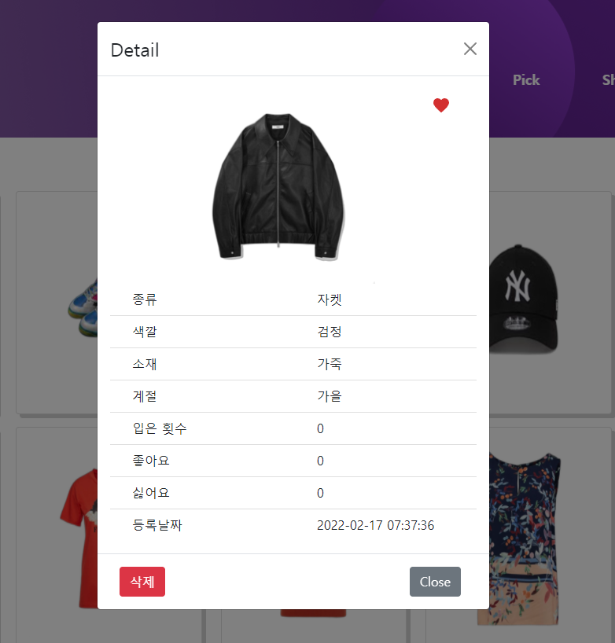
  - 옷 사진을 클릭하면 옷의 상세정보를 확인할 수 있습니다.
  - 하트 버튼을 통해 즐겨찾기를 할 수 있고 삭제 버튼을 통해 삭제할 수 있습니다.

- 카테고리 별 조회
  - 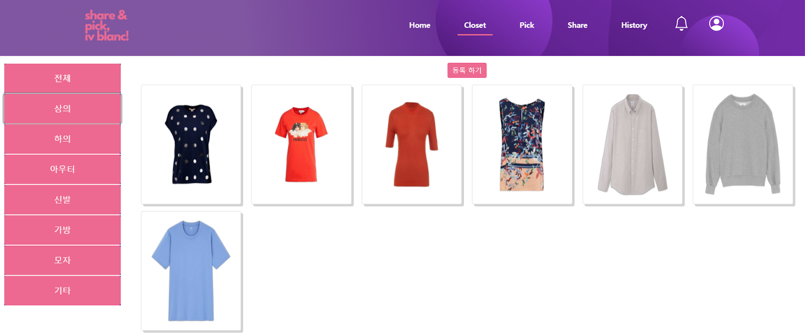
  - 사이드바의 카테고리를 선택하면 해당하는 카테고리의 옷 종류를 확인할 수 있습니다.

### 스타일링(Pick)

> 등록한 옷 정보로 원하는 스타일링을 해볼 수 있습니다.
>
> 상의의 경우 AI 스타일링을 통해 모델에게 옷을 입혀볼 수 있습니다.
>
> 등록한 스타일의 룩을 확인할 수 있습니다.

- 스타일링

  - 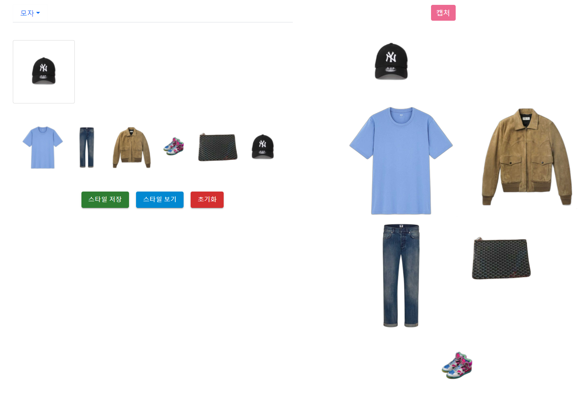
  - 등록한 옷을 이용하여 원하는 스타일링을 할 수 있도록 지원합니다.
  - 카테고리 별로 하나의 옷만 선택하여야 합니다
    - 하나의 카테고리에 여러 옷을 선택한 경우 가장 먼저 선택한 옷이 스타일에 적용됩니다.
  - 스타일링을 위한 옷을 선택했다면 스타일 보기 버튼을 통해 스타일 사진을 큰 화면으로 볼 수 있습니다.
  - 스타일링 중간 다른 옷을 선택하고 싶거나 수정해야 할 경우 
    - 초기화 버튼을 클릭하여 초기화한 후에 스타일링을 진행할 수 있습니다.
  - 스타일 보기를 통해 큰 화면으로 확인했다면 캡처 버튼을 눌러 사진으로 저장합니다.

- 스타일 저장

  - 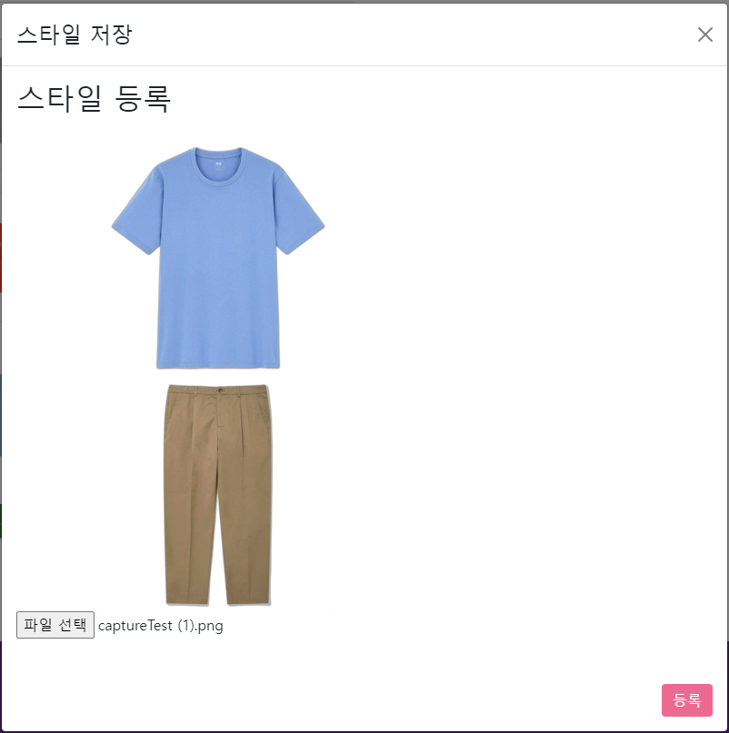

    

  - 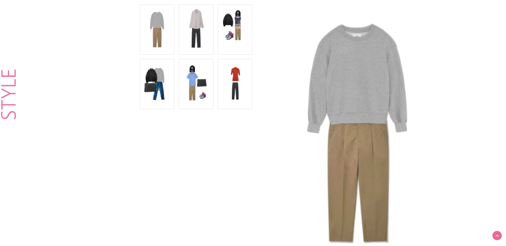

  - 스타일링을 사진으로 저장했다면 스타일 저장 버튼을 통해 스타일을 저장합니다.

  - 캡처한 사진을 올린 후 등록 버튼을 누르면 저장됩니다.

  - 스타일 화면에서 룩 탭을 선택하면 저장한 스타일을 확인할 수 있습니다.

    - 스타일 사진을 클릭하면 큰 화면으로 확인 가능합니다.

- AI 스타일링

  - 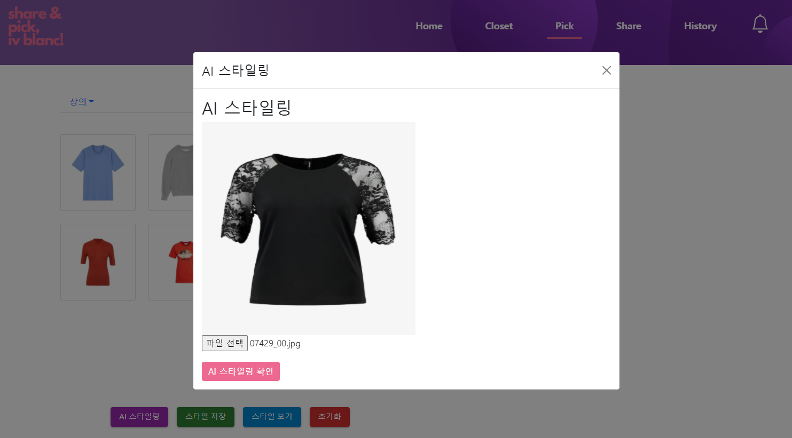
  - 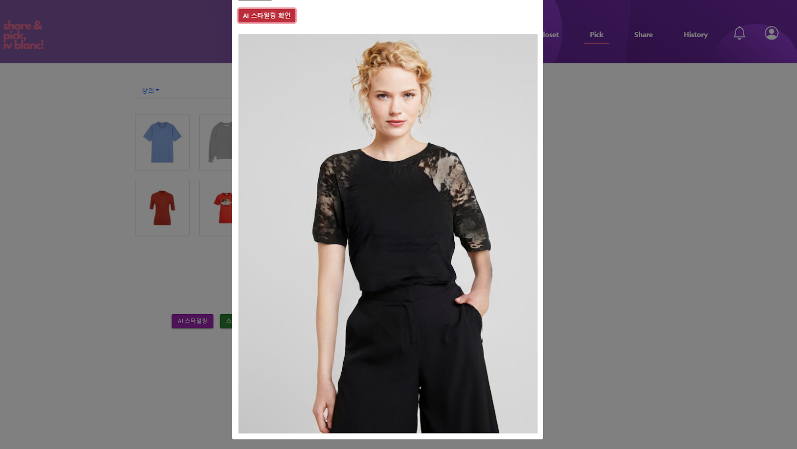
  - **상의에 한해서만** AI 스타일링을 통해 모델에게 입힌 사진을 볼 수 있습니다.
  - 상의 카테고리 탭을 선택 후 상의 사진을 클릭하면 AI 스타일링 버튼이 뜹니다.
  - 원하는 상의 사진을 선택 후 확인 버튼을 누르면 모델이 해당 상의를 입은 사진을 확인할 수 있습니다.
  - 사진 파일의 이름은 **영문, 숫자만 가능**하며 한글 이름은 작동하지 않습니다.
  - 파일 확장자는 **jpg, png**로만 테스트 해주시기 바랍니다. jpeg는 지원하지 않고 다른 확장자 파일도 서버에 동작이 안될 수 있습니다.

### 친구 등록(Share)

> 입을랑은 친구 추가를 통해 친구의 옷을 확인하고 직접 친구 스타일링이 가능합니다.

- 친구 추가

  - 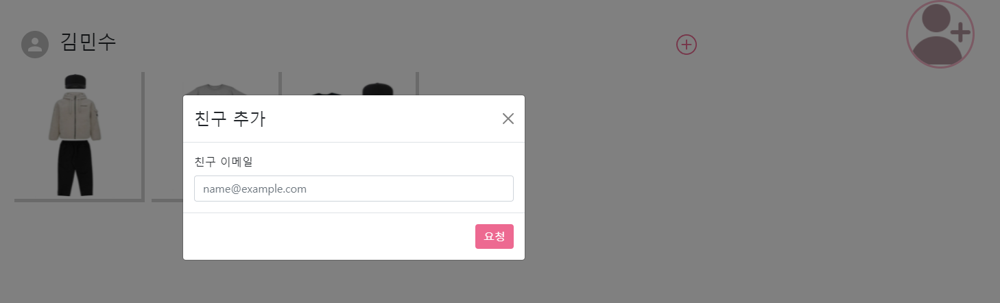
  - 친구를 추가할 수 있는 기능입니다.
  - 아이콘을 눌러 상대방의 이메일을 입력하면 상대방에게 알림이 갑니다.
  - 상대방이 친구 수락을 누른 경우
    - 친구 목록에 상대방의 옷장을 확인할 수 있습니다.
  - 상대방이 친구 수락을 하지 않은 경우
    - 친구 목록에 상대방의 옷장이 나타나지 않습니다.

- 친구 수락

  - 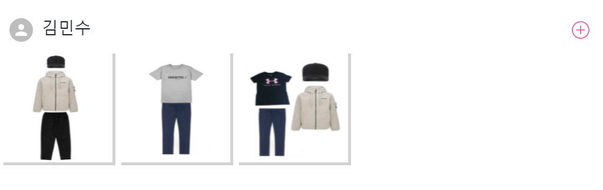

    

  - 상대방이 나에게 친구추가를 했다면 알림이 뜹니다.

  - 알림에서 수락 버튼을 눌러 친구 등록을 합니다.

    - 새로고침을 통해 친구 옷장을 확인할 수 있습니다.

- 친구 옷장 확인

  - 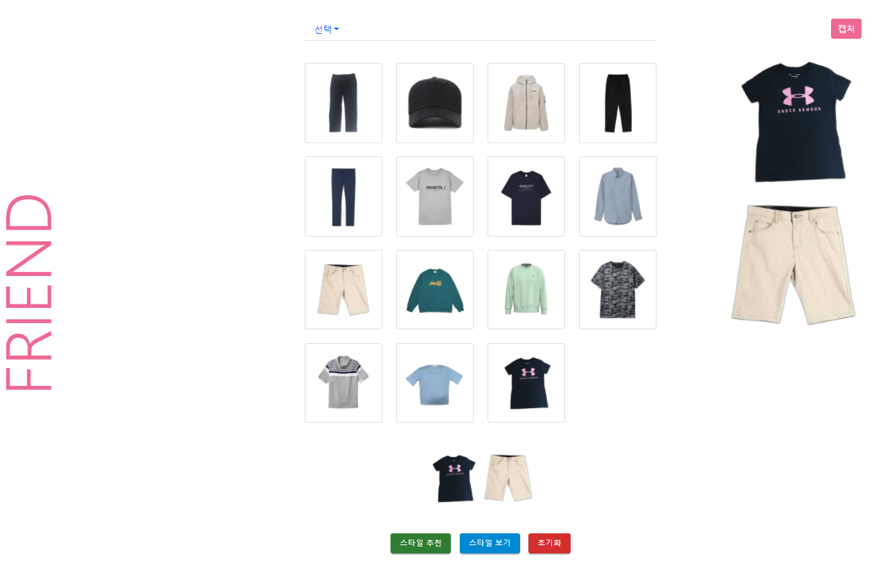

    \+ 버튼을 통해 친구의 옷장으로 이동 가능합니다.

  - 친구의 옷을 확인하면서 스타일링을 해줄 수 있습니다.

  - 스타일링을 한 후 캡쳐 버튼을 통해 사진을 저장합니다.

  - 사용자가 만든 스타일링을 친구 스타일 목록에 저장할 수 있습니다. 

### 히스토리(History)

> 자신의 스타일과 그 날에 대한 여러 정보를 함께 저장하고 볼 수 있습니다.
>
> 시간을 기준으로 한 캘린더와, 장소를 기준으로 한 지도를 통해 히스토리를 확인할 수 있습니다.

- 추억하기

  - 히스토리를 등록할 수 있는 기능입니다.

  - 추억하기 버튼을 눌러 자신의 스타일과 그 날 찍은 사진 등 여러 정보를 입력할 수 있습니다.

    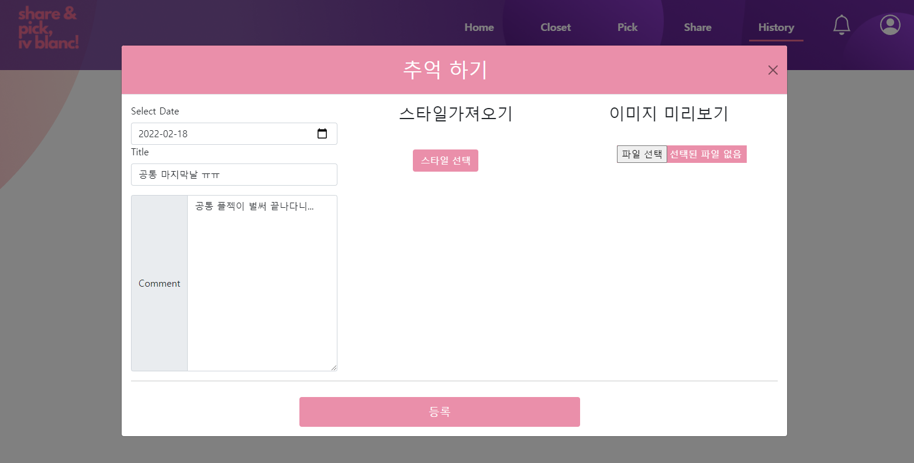

    - 스타일 선택 버튼을 통해 저장한 스타일을 불러올 수 있습니다.

    - 등록된 히스토리의 앞면은 실제 찍은 사진, 뒷면은 스타일 및 정보를 확인할 수 있습니다.

      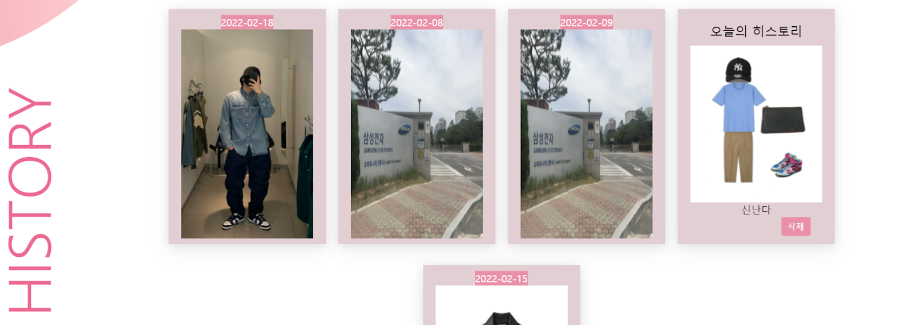